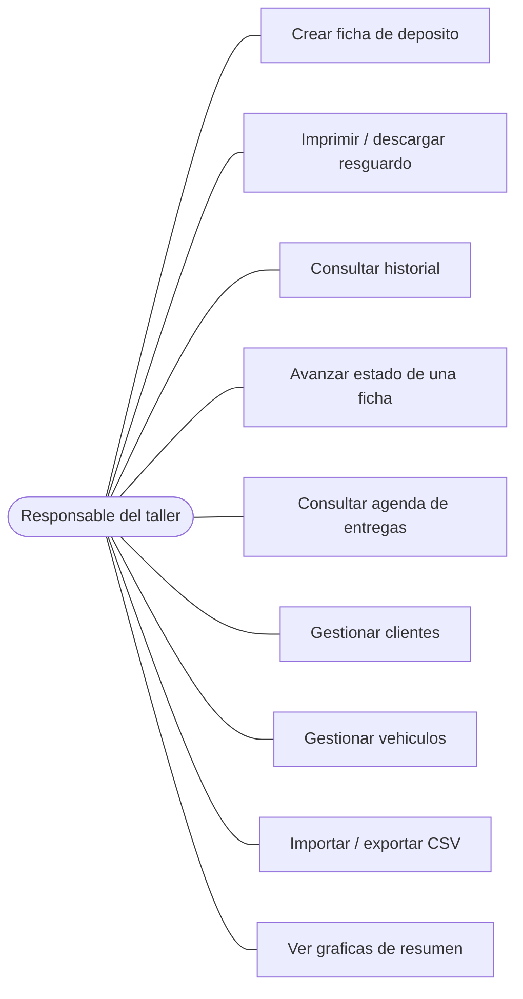
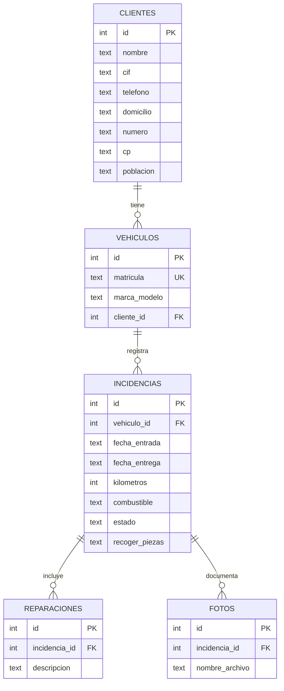
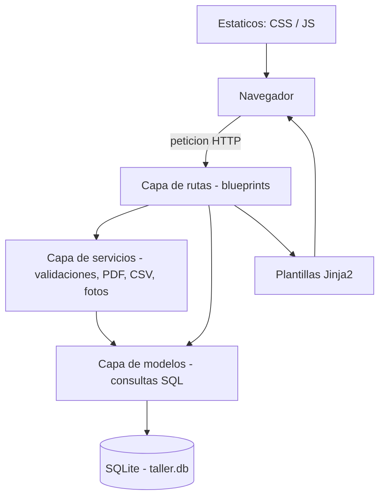
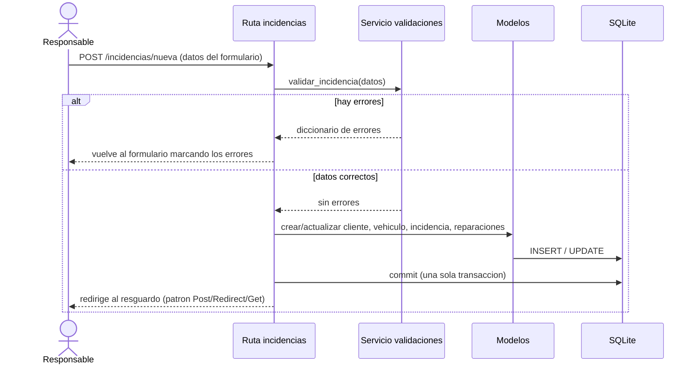

# GestorTaller
### Aplicación web para la gestión de un taller de automóviles

**Trabajo de Fin de Grado — Desarrollo de Aplicaciones Multiplataforma (DAM)**

- Autor: [Nombre y apellidos]
- Centro: [Nombre del centro]
- Tutor/a: [Nombre del tutor/a]
- Curso: [20XX / 20XX]

---

## Resumen

GestorTaller es una aplicación web para gestionar el día a día de un taller de
automóviles: clientes, vehículos, las entradas de los coches al taller y, sobre
todo, el **resguardo de depósito**, el documento que se entrega al cliente cuando
deja el vehículo.

El proyecto no empezó siendo un TFG. Al principio era un programa pequeño y
sencillo que hice para echar una mano a mis padres en su taller: una aplicación
de escritorio cuya única tarea era rellenar e imprimir ese resguardo, que hasta
entonces se hacía a mano. Funcionaba, pero se quedaba corto —solo servía en un
ordenador, no guardaba ningún histórico de los coches y costaba ampliarlo—, así
que para el Trabajo de Fin de Grado decidí rehacerlo desde cero y convertirlo en
algo más completo y útil.

El resultado es una aplicación web desarrollada con **Flask** (Python) y base de
datos **SQLite** que mantiene la función original —generar e imprimir el
resguardo, y además descargarlo en PDF— y la rodea de todo lo que faltaba: una
base de datos que guarda clientes, vehículos e historial de entradas, el
autorrelleno de los datos a partir de la matrícula, el seguimiento del estado de
cada reparación, una agenda de entregas, la importación y exportación de datos en
CSV y un panel de inicio con gráficas de resumen.

El código está organizado por capas para que sea fácil de entender y mantener; la
aplicación se ejecuta en la red local del taller desde cualquier navegador y es
genérica: para adaptarla a otro taller solo hay que cambiar un fichero de
configuración.

**Palabras clave:** Flask, Python, SQLite, aplicación web, taller, resguardo de
depósito, gestión.

---

## Índice

1. Introducción
2. Objetivos
3. Análisis
   - 3.1. Situación de partida
   - 3.2. Requisitos funcionales
   - 3.3. Requisitos no funcionales
   - 3.4. Casos de uso
4. Diseño
   - 4.1. Arquitectura de la aplicación
   - 4.2. Modelo de datos (diagrama ER)
   - 4.3. Diagrama de componentes
   - 4.4. Flujo de una operación (diagrama de secuencia)
   - 4.5. Diseño de la interfaz
5. Tecnologías y herramientas
6. Implementación
   - 6.1. Estructura del proyecto
   - 6.2. Capa de modelos
   - 6.3. Capa de rutas
   - 6.4. Capa de servicios
   - 6.5. Decisiones técnicas destacadas
7. Pruebas
8. Manual de instalación y despliegue
9. Manual de usuario
10. Conclusiones y líneas futuras
11. Bibliografía

---

## 1. Introducción

El proyecto nace de una necesidad real y cercana. El taller de automóviles de mi
familia llevaba tiempo usando un pequeño programa de escritorio, hecho en Python
con la librería gráfica Tkinter, para rellenar e imprimir el resguardo de
depósito del vehículo: el papel que se entrega al cliente cuando deja el coche en
el taller. Ese programa cumplía su función, pero se había quedado corto:
funcionaba solo en el ordenador donde estaba instalado, no guardaba de forma
estructurada los coches que habían pasado por el taller, el número de líneas de
reparación era fijo y todo el código estaba en un único fichero, lo que hacía
difícil mantenerlo o ampliarlo.

La idea del TFG es rehacer esa herramienta desde cero y convertirla en una
aplicación web. Una aplicación web aporta ventajas claras en este contexto: se
puede usar desde varios equipos de la red del taller (por ejemplo, el del
mostrador y el de la oficina), no necesita instalación en cada puesto y permite
guardar los datos de forma centralizada en una base de datos. Además, al rehacer
el programa se puede organizar el código de una forma más limpia y ampliarlo con
funciones nuevas.

Para el desarrollo se ha elegido **Flask** [1], un framework web de Python
ligero y muy usado, junto con **SQLite** [2] como base de datos, por ser sencilla
y no requerir instalar ningún servidor aparte. La interfaz se ha construido con
**Bootstrap** [5] para que se vea correctamente en pantallas de distinto tamaño.

---

## 2. Objetivos

**Objetivo general:** desarrollar una aplicación web que sustituya y amplíe el
pequeño programa de escritorio inicial, manteniendo la generación del resguardo
de depósito y añadiéndole la gestión de clientes, vehículos e historial.

**Objetivos específicos:**

- Migrar la generación del resguardo a un entorno web, conservando la posibilidad
  de imprimirlo y permitiendo además descargarlo en PDF.
- Diseñar una base de datos relacional que guarde clientes, vehículos, las
  entradas al taller (incidencias) y sus reparaciones.
- Implementar la validación de los datos del formulario tanto en el navegador
  (para avisar pronto al usuario) como en el servidor (que es la que cuenta).
- Añadir funciones útiles para el día a día del taller: autorrelleno por
  matrícula, control del estado de la reparación, agenda de entregas y un panel
  de gráficas.
- Permitir exportar e importar los datos en CSV para poder trabajar con ellos en
  una hoja de cálculo.
- Organizar el código por capas para que sea fácil de entender, mantener y
  defender.
- Que la aplicación sea genérica y se pueda adaptar a cualquier taller cambiando
  solo la configuración.

---

## 3. Análisis

### 3.1. Situación de partida

El punto de partida era un programa de escritorio en Python + Tkinter de un solo
fichero. Sus principales limitaciones eran:

- **Solo local:** funcionaba únicamente en el ordenador donde estaba instalado.
- **Sin histórico:** no guardaba de forma estructurada los datos de los coches
  que habían pasado por el taller, por lo que no se podían consultar fichas
  anteriores ni reutilizar los datos de un cliente conocido.
- **Líneas de reparación fijas:** el resguardo tenía un número fijo de líneas (5)
  para describir los trabajos.
- **Difícil de mantener:** al estar todo en un único fichero, mezclando la
  interfaz, la lógica y la generación del documento, cualquier cambio era
  laborioso.

El análisis de la aplicación original sirvió para identificar qué había que
conservar (el resguardo y sus datos) y qué se podía mejorar (la persistencia, la
organización del código y la flexibilidad).

### 3.2. Requisitos funcionales

Son las cosas que la aplicación tiene que **hacer**:

| Código | Requisito |
|--------|-----------|
| RF-01 | Dar de alta una ficha de depósito (incidencia) con los datos del cliente, del vehículo, las fechas, el kilometraje, el nivel de combustible, los trabajos a realizar y si el cliente desea recoger las piezas. |
| RF-02 | Generar el resguardo de depósito en pantalla, listo para imprimir. |
| RF-03 | Descargar el resguardo en formato PDF. |
| RF-04 | Autorrellenar los datos del cliente y del vehículo al escribir una matrícula ya registrada. |
| RF-05 | Adjuntar fotografías del estado del vehículo a una ficha, así como borrarlas. |
| RF-06 | Consultar el historial de fichas, con búsqueda por matrícula, nombre de cliente o fecha. |
| RF-07 | Avanzar el estado de una ficha siguiendo el flujo: recepcionado → en reparación → terminado → entregado. |
| RF-08 | Mostrar una agenda de entregas que agrupe las fichas pendientes en vencidas, de hoy y próximas. |
| RF-09 | Gestionar los clientes (listar, crear, editar y borrar). |
| RF-10 | Gestionar los vehículos (listar, crear, editar y borrar), asignando cada uno a un cliente. |
| RF-11 | Exportar a CSV los clientes, los vehículos y el historial completo. |
| RF-12 | Importar desde CSV clientes, vehículos e historial. |
| RF-13 | Mostrar un panel de inicio con gráficas de resumen (fichas por estado y fichas por mes). |

### 3.3. Requisitos no funcionales

Son las características de **cómo** debe comportarse la aplicación:

| Código | Requisito |
|--------|-----------|
| RNF-01 | **Validación doble.** Los datos se validan en el navegador (comodidad para el usuario) y en el servidor (validación autoritativa, ya que el navegador se puede saltar). |
| RNF-02 | **Integridad de los datos.** Las operaciones que tocan varias tablas se hacen en una única transacción (o se guarda todo o no se guarda nada) y se usan claves foráneas. |
| RNF-03 | **Seguridad básica.** Las consultas usan parámetros para evitar inyección SQL; las fotos se sirven con un mecanismo que impide salir de su carpeta (path traversal) y se valida su tipo y tamaño en el servidor. |
| RNF-04 | **Portabilidad.** El proyecto usa rutas relativas y funciona igual en Windows y en Linux, con Python 3.10 o superior. |
| RNF-05 | **Reutilización.** La aplicación es genérica: los datos del taller están en un fichero de configuración y no repartidos por el código. |
| RNF-06 | **Usabilidad.** La interfaz es responsive (Bootstrap) y da información al usuario mediante mensajes de aviso tras cada acción. |
| RNF-07 | **Mantenibilidad.** El código está organizado por capas y documentado en español, explicando el porqué de las decisiones. |
| RNF-08 | **Cumplimiento legal.** El tratamiento de los datos personales del cliente debe ajustarse al RGPD [10] y a la LOPDGDD [11]; el resguardo se basa en el RD 1457/1986 [9], que regula la actividad de los talleres. |

### 3.4. Casos de uso

El sistema tiene un único actor: **el responsable del taller**, es decir, la
persona que se ocupa de la recepción y de la parte administrativa (el gerente o
el encargado). Es quien atiende al cliente, da de alta la ficha de depósito y
hace el seguimiento de los trabajos. Los mecánicos realizan las reparaciones,
pero no usan la aplicación, así que no se ha definido un perfil aparte para
ellos. Como la herramienta se utiliza dentro del propio taller, tampoco se han
diferenciado roles ni se ha añadido todavía un control de acceso con usuario y
contraseña (queda como línea futura).



**Ejemplo de caso de uso detallado — Crear ficha de depósito (RF-01):**

- **Actor:** el responsable del taller.
- **Precondición:** la aplicación está en marcha.
- **Flujo principal:**
  1. Abre el formulario de nueva ficha.
  2. Escribe la matrícula. Si ya está registrada, los datos del cliente y del
     vehículo se rellenan solos (RF-04).
  3. Completa o corrige el resto de datos (fechas, kilometraje, trabajos…).
  4. Opcionalmente adjunta fotos del estado del coche.
  5. Pulsa «Generar resguardo».
  6. El sistema valida los datos. Si todo es correcto, los guarda y muestra el
     resguardo.
- **Flujo alternativo:** si algún dato no es válido, el sistema vuelve al
  formulario, conserva lo escrito y señala los campos con error.

---

## 4. Diseño

### 4.1. Arquitectura de la aplicación

La aplicación sigue una organización **por capas**, que separa las
responsabilidades y facilita el mantenimiento:

- **Capa de presentación:** las plantillas HTML (`templates/`) y los ficheros
  estáticos (`static/`, con el CSS y el JavaScript). Es lo que ve y usa el
  responsable del taller.
- **Capa de rutas (controladores):** la carpeta `rutas/`. Cada fichero es un
  *blueprint* de Flask que agrupa las rutas de una parte de la aplicación
  (inicio, incidencias, agenda, clientes, vehículos, datos). Recibe las
  peticiones, coordina el trabajo y devuelve la respuesta.
- **Capa de servicios:** la carpeta `servicios/`. Contiene la lógica que no es ni
  interfaz ni acceso directo a datos: las validaciones, la generación del PDF, la
  importación/exportación de CSV, el guardado de las fotos y el formateo de
  fechas.
- **Capa de acceso a datos (modelos):** la carpeta `modelos/`. Cada fichero se
  encarga de una tabla y contiene únicamente las consultas SQL. Las funciones
  reciben la conexión ya abierta y no hacen el `commit`: de la transacción se
  encarga la ruta. Así, varias operaciones pueden ir en una misma transacción.

El uso de blueprints permite registrar todas las rutas desde el fichero principal
(`app.py`) de forma ordenada. También se emplea un *context processor* para que
los datos del taller estén disponibles en todas las plantillas sin tener que
pasarlos en cada página, y un filtro de plantilla propio (`fecha_es`) para
mostrar las fechas en formato dd/mm/aaaa.

### 4.2. Modelo de datos (diagrama ER)

La base de datos relaciona cinco tablas. Un cliente puede tener varios
vehículos; cada vehículo puede tener varias incidencias (entradas al taller);
cada incidencia tiene varias líneas de reparación y, opcionalmente, varias fotos.



Decisiones de diseño de la base de datos:

- La **matrícula** del vehículo es `UNIQUE`: no puede repetirse, porque
  identifica al coche. Es la clave que usa el autorrelleno.
- El **estado** de la incidencia tiene una restricción `CHECK` que solo admite
  los cuatro valores válidos, de modo que la propia base de datos garantiza que
  el dato es correcto.
- Las **fechas** se guardan en formato ISO (`AAAA-MM-DD`), que es el que usan
  tanto SQLite como el campo `<input type="date">` del HTML. Una ventaja de este
  formato es que el orden alfabético coincide con el cronológico, lo que permite
  ordenar y comparar fechas como texto.
- Las **fotos** guardan en la base de datos solo el nombre del archivo; la imagen
  se almacena en una carpeta del disco. La relación con la incidencia usa
  `ON DELETE CASCADE`, de forma que al borrar una incidencia se borran también
  sus filas de fotos y reparaciones.

### 4.3. Diagrama de componentes

El siguiente diagrama muestra cómo se relacionan las capas descritas y por dónde
circula una petición:



### 4.4. Flujo de una operación (diagrama de secuencia)

Como ejemplo de cómo colaboran las capas, este diagrama de secuencia representa
el alta de una nueva ficha (RF-01), que es la operación más completa porque toca
cuatro tablas dentro de una misma transacción:



### 4.5. Diseño de la interfaz

La interfaz parte de una plantilla base (`base.html`) que define la barra de
navegación, el pie y los estilos comunes; el resto de páginas heredan de ella
(herencia de plantillas de Jinja2). Se ha usado Bootstrap para la maquetación y
un color de acento naranja, definido una sola vez como variable CSS, para dar
identidad visual.

El resguardo merece una mención aparte: en pantalla se ve como un folio y, gracias
a una hoja de estilos de impresión (`@media print`), al imprimirlo desde el
navegador desaparecen la barra, el pie y los botones, y queda solo el documento
ajustado a un A4. Así no hace falta una plantilla distinta para imprimir:

```css
@media print {
  /* Se oculta todo lo que es de la web y no del documento. */
  .barra-app, .pie-app, .no-imprimir { display: none !important; }

  /* La hoja, a pantalla completa y sin sombra ni recuadro. */
  .hoja { box-shadow: none; max-width: none; width: 100%; padding: 0; }

  @page { size: A4; margin: 1.2cm; }
}
```

Los botones y avisos que no deben salir en el papel llevan la clase
`no-imprimir`, que esa misma regla esconde.

---

## 5. Tecnologías y herramientas

| Tecnología | Uso en el proyecto |
|-----------|--------------------|
| **Python 3.10+** | Lenguaje principal del lado del servidor. |
| **Flask** [1] | Framework web: rutas, plantillas y peticiones. |
| **SQLite** [2] | Base de datos. No necesita servidor; el fichero se crea solo. |
| **ReportLab** [4] | Generación del resguardo en PDF desde el servidor. |
| **Waitress** [3] | Servidor WSGI para ejecutar la aplicación en producción / demo. |
| **HTML, CSS y JavaScript** | Estructura, estilo y validación en el navegador. |
| **Bootstrap 5.3** [5] | Maquetación responsive y componentes de la interfaz. |
| **Bootstrap Icons** | Iconos de la interfaz. |
| **Chart.js 4.4** [6] | Gráficas del panel de inicio. |
| **Git** | Control de versiones, con una rama por bloque de funcionalidad. |
| **Visual Studio Code** | Editor de código y depuración. |

Bootstrap, Bootstrap Icons y Chart.js se cargan desde un CDN en el HTML; no se
instalan con `pip` porque son librerías de JavaScript/CSS. Las dependencias de
Python están recogidas en `requirements.txt`.

---

## 6. Implementación

### 6.1. Estructura del proyecto

```
gestor_taller/
├── app.py            punto de entrada (desarrollo)
├── servidor.py       arranque en produccion (Waitress)
├── config.py         configuracion y datos del taller
├── datos_ejemplo.py  siembra datos de prueba
├── requirements.txt
├── modelos/          acceso a datos + esquema.sql
├── rutas/            las pantallas (blueprints)
├── servicios/        validaciones, PDF, CSV, fotos, formato
├── templates/        plantillas HTML
├── static/           CSS y JavaScript
└── datos/            base de datos SQLite (se crea sola)
```

Cada carpeta es una capa de la arquitectura descrita en el apartado 4.1, así que
el sitio donde está un fichero ya dice de qué se ocupa.

### 6.2. Capa de modelos

He organizado los modelos como **módulos de funciones**, uno por tabla
(`cliente.py`, `vehiculo.py`, `incidencia.py`, `reparacion.py`, `foto.py`), en
lugar de como clases. Para una base de datos pequeña como esta, en la que cada
función es prácticamente una consulta, las clases no aportaban gran cosa y solo
habrían añadido código repetido. Si el proyecto creciera, el siguiente paso
natural sería encapsular cada tabla en una clase o pasar a un ORM como
SQLAlchemy.

Todo el acceso a SQLite pasa por `conexion.py`, que abre la conexión con dos
ajustes importantes: leer las filas por nombre de columna y activar las claves
foráneas (que SQLite trae desactivadas por defecto):

```python
def obtener_conexion():
    """Abre y devuelve una conexión a la base de datos."""
    conexion = sqlite3.connect(RUTA_BD)
    conexion.row_factory = sqlite3.Row            # leer columnas por nombre
    conexion.execute("PRAGMA foreign_keys = ON")  # respetar las claves foráneas
    return conexion
```

El criterio común de los modelos es que **las funciones reciben la conexión ya
abierta y solo ejecutan su consulta**; no hacen `commit` ni cierran la conexión.
De eso se encarga la ruta que las llama, lo que permite que varias operaciones
(crear cliente, vehículo e incidencia) vayan dentro de la misma transacción.
Además, todas las consultas usan parámetros (`?`) en vez de construir el SQL
concatenando texto, lo que evita la inyección SQL (RNF-03):

```python
def crear(con, matricula, marca_modelo, cliente_id):
    """Inserta un vehículo y devuelve su id."""
    cursor = con.execute(
        """INSERT INTO vehiculos (matricula, marca_modelo, cliente_id)
           VALUES (?, ?, ?)""",
        (matricula, marca_modelo, cliente_id),
    )
    return cursor.lastrowid
```

### 6.3. Capa de rutas

La carpeta `rutas/` contiene un blueprint por cada zona de la aplicación. El
patrón habitual en los formularios es: una petición `GET` muestra el formulario y
una petición `POST` valida los datos y, si son correctos, los guarda. Tras
guardar, la ruta **redirige** en lugar de devolver directamente el HTML (patrón
Post/Redirect/Get); así, si el usuario recarga la página, no se vuelve a guardar
la misma ficha por error.

Las operaciones que modifican datos van dentro de un `try/except` con `commit` al
final y `rollback` si algo falla, para no dejar los datos a medias (RNF-02). Este
es el guardado de una ficha, donde cliente, vehículo, incidencia, reparaciones y
fotos se confirman juntos o no se confirma nada:

```python
con = obtener_conexion()
try:
    incidencia_id = _guardar_incidencia(con, datos)
    subidas, descartadas = _guardar_fotos(
        con, incidencia_id, request.files.getlist("fotos"))
    con.commit()            # confirma cliente, vehículo, ficha, líneas y fotos
except Exception:
    con.rollback()          # si algo falla, no se guarda nada a medias
    flash("No se ha podido guardar la ficha. Inténtalo de nuevo.", "error")
    return render_template("incidencia_form.html", datos=datos, errores={})
finally:
    con.close()
```

### 6.4. Capa de servicios

- **`validaciones.py`**: las validaciones del servidor (DNI/NIE/CIF, teléfono,
  código postal, matrícula, fechas y kilometraje), reunidas en un solo sitio.
- **`pdf.py`**: genera el resguardo en PDF con ReportLab. En vez de dibujar en
  coordenadas exactas, trabaja con bloques (párrafos y tablas) y deja que la
  librería los coloque, lo que es más fácil de mantener. El PDF se crea en memoria
  y se envía como descarga, sin guardar ningún fichero en el servidor.
- **`csv_datos.py`**: importa y exporta los datos en CSV. Usa el separador `;` y
  codificación UTF-8 con BOM para que los acentos y la Ñ se vean bien en Excel en
  español. Al importar reaprovecha las mismas validaciones del formulario.
- **`fotos.py`**: valida (tipo y tamaño) y guarda las imágenes en disco con un
  nombre aleatorio, y borra el archivo cuando se elimina la foto.
- **`formato.py`**: la función `fecha_es`, que convierte las fechas de ISO a
  dd/mm/aaaa y la usan tanto las plantillas como el PDF.

### 6.5. Decisiones técnicas destacadas

Estas son algunas de las decisiones que se pueden justificar ante el tribunal.

**Validación doble (RNF-01).** El JavaScript (`static/js/validaciones.js`) avisa
al usuario mientras escribe, pero la validación que decide si se guarda está en el
servidor, porque el navegador puede manipularse o desactivar el JavaScript. Las
reglas (expresiones regulares, algoritmo del DNI) son las mismas en los dos lados.

**Algoritmo del DNI/NIE.** La letra del DNI se comprueba con el algoritmo oficial
del módulo 23: el número se divide entre 23 y el resto da la posición de la letra
en una cadena fija. Para el NIE, la primera letra (X, Y, Z) se sustituye por 0, 1
o 2 y se valida igual. El CIF, de momento, solo se valida en su formato (su dígito
de control tiene varias reglas); se ha dejado anotado como mejora futura.

```python
_LETRAS_DNI = "TRWAGMYFPDXBNJZSQVHLCKE"

def _letra_dni_correcta(dni):
    numero = int(dni[:8])
    return dni[8] == _LETRAS_DNI[numero % 23]

def _letra_nie_correcta(nie):
    # X=0, Y=1, Z=2: se sustituye la primera letra y se valida como un DNI.
    primera = {"X": "0", "Y": "1", "Z": "2"}[nie[0]]
    numero = int(primera + nie[1:8])
    return nie[8] == _LETRAS_DNI[numero % 23]
```

**Normalización de la matrícula.** Una única función deja la matrícula en
mayúsculas y sin guiones ni espacios, y se usa en el formulario, en la gestión de
vehículos, en el autorrelleno y en el CSV, para que «1234-bcd» y «1234 BCD» se
traten como la misma:

```python
def normalizar_matricula(texto):
    """Mayúsculas y sin guiones ni espacios: '1234-bcd' -> '1234BCD'."""
    return (texto or "").upper().replace("-", "").replace(" ", "")
```

**Estados derivados de una lista.** El orden de los estados está definido una sola
vez en una tupla; el estado siguiente se calcula a partir de la posición en esa
tupla, en lugar de repartir esa lógica con condicionales por el código:

```python
ESTADOS = ("recepcionado", "en reparación", "terminado", "entregado")

def siguiente_estado(estado_actual):
    """Devuelve el estado siguiente, o None si ya está en el último."""
    posicion = ESTADOS.index(estado_actual)
    if posicion + 1 < len(ESTADOS):
        return ESTADOS[posicion + 1]
    return None
```

**Seguridad de las fotos.** Cada imagen se guarda con un nombre aleatorio
(`uuid4`) y se sirve con `send_from_directory`, que impide construir rutas que se
salgan de la carpeta de fotos (path traversal). El tipo y el tamaño (máximo 5 MB)
se comprueban en el servidor, no solo con el `accept` del formulario.

---

## 7. Pruebas

Las pruebas realizadas han sido funcionales y manuales, comprobando cada
requisito sobre la aplicación en marcha. Para ello se ha usado el script
`datos_ejemplo.py`, que rellena la base con datos de prueba inventados.

| Prueba | Resultado esperado |
|--------|--------------------|
| Guardar una ficha con un DNI con letra incorrecta | El servidor rechaza el dato y marca el campo. |
| Guardar con teléfono, CP o matrícula con formato no válido | Se señala el campo correspondiente. |
| Fecha de entrega anterior a la de entrada | Se muestra el error de coherencia de fechas. |
| Escribir una matrícula ya registrada | Se rellenan solos los datos del cliente y del vehículo. |
| Subir una foto que no es imagen o supera 5 MB | La foto se descarta y se avisa. |
| Avanzar el estado hasta «entregado» | El botón de avanzar deja de aparecer. |
| Intentar borrar un cliente con vehículos | No se permite y se muestra un aviso. |
| Intentar borrar un vehículo con fichas | No se permite y se muestra un aviso. |
| Exportar a CSV y volver a importar | Los datos se recuperan correctamente. |
| Provocar un error a mitad del guardado | No se guarda nada (la transacción se deshace). |
| Descargar el resguardo en PDF | Se descarga el documento con los datos correctos. |

---

## 8. Manual de instalación y despliegue

**Requisitos:** Python 3.10 o superior.

1. Crear y activar un entorno virtual:

   ```
   python -m venv venv
   venv\Scripts\activate        (Windows)
   source venv/bin/activate     (Linux / Mac)
   ```

2. Instalar las dependencias:

   ```
   pip install -r requirements.txt
   ```

3. Ejecutar la aplicación:

   - En **desarrollo** (con recarga automática): `python app.py` →
     `http://127.0.0.1:5000`
   - En **producción / demo** (servidor Waitress): `python servidor.py` →
     `http://127.0.0.1:8000`

   La base de datos se crea sola la primera vez.

4. (Opcional) Rellenar datos de prueba: `python datos_ejemplo.py`.

Para que el tribunal pueda probarla sin instalar Python, el proyecto incluye
también la configuración necesaria para empaquetarla en un único ejecutable
(`.exe`) con PyInstaller: basta con hacer doble clic y se abre el navegador con
la aplicación en marcha. La aplicación es, además, una app WSGI estándar de
Flask, así que también puede subirse a un alojamiento gratuito como
PythonAnywhere o Render siguiendo la guía oficial de cada plataforma.

---

## 9. Manual de usuario

**Inicio.** Muestra accesos directos a las funciones principales y dos gráficas
de resumen (fichas por estado y fichas por mes).

**Nueva ficha.** Se rellenan los datos del vehículo y del cliente, los trabajos a
realizar y, si se quiere, fotos del estado del coche. Si la matrícula ya existe,
los datos del cliente se rellenan solos. Al pulsar «Generar resguardo» se guarda
la ficha y se muestra el documento.

**Resguardo.** El documento listo para imprimir (botón «Imprimir») o descargar en
PDF (botón «Descargar PDF»). Desde aquí también se pueden añadir o quitar fotos.

**Historial.** Lista de fichas guardadas, con un buscador por matrícula, nombre o
fecha. Cada fila tiene un botón para avanzar el estado de la reparación y otro
para ver el resguardo.

**Agenda.** Reúne las fichas pendientes de entregar, agrupadas en vencidas, de hoy
y próximas.

**Clientes y Vehículos.** Pantallas de gestión para dar de alta, editar o borrar.
No se puede borrar un cliente con vehículos ni un vehículo con fichas, para no
perder el historial.

**Datos (CSV).** Permite descargar los datos en CSV para abrirlos en Excel y subir
un CSV para cargarlos en la aplicación.

---

## 10. Conclusiones y líneas futuras

El proyecto ha cumplido su objetivo: lo que empezó como un pequeño programa para
imprimir el resguardo es ahora una aplicación web que gestiona el taller y que
conserva esa función original ampliándola con persistencia de datos, historial,
estados, agenda, CSV y gráficas. El desarrollo me ha permitido aplicar de forma
práctica la programación web del lado del servidor, el diseño de bases de datos
relacionales y la organización del código por capas.

La mayor dificultad ha sido decidir cómo repartir las responsabilidades entre las
capas y mantener la coherencia entre la validación del navegador y la del
servidor. La solución por capas, aunque exige más ficheros, ha hecho el código
mucho más fácil de seguir, y reunir cada tipo de validación en un único sitio
evitó que las reglas del cliente y del servidor se acabaran descuadrando.

**Líneas futuras:**

- Validar también el dígito de control del CIF.
- Restaurar los textos legales del resguardo (garantía y protección de datos
  conforme al RGPD/LOPDGDD) para el uso real en el taller.
- Añadir autenticación de usuarios y protección CSRF de cara a un despliegue
  público.
- Desplegar la aplicación en un alojamiento en la nube.

---

## 11. Bibliografía

[1] Pallets Projects. *Flask Documentation*. https://flask.palletsprojects.com

[2] SQLite. *SQLite Documentation*. https://www.sqlite.org/docs.html

[3] Pylons Project. *Waitress Documentation*. https://docs.pylonsproject.org/projects/waitress/

[4] ReportLab. *ReportLab User Guide*. https://docs.reportlab.com

[5] Bootstrap. *Bootstrap Documentation (v5.3)*. https://getbootstrap.com/docs/5.3/

[6] Chart.js. *Chart.js Documentation*. https://www.chartjs.org/docs/latest/

[7] Mozilla. *MDN Web Docs*. https://developer.mozilla.org

[8] Python Software Foundation. *Python Documentation*. https://docs.python.org/3/

[9] Real Decreto 1457/1986, por el que se regula la actividad industrial y la
prestación de servicios en los talleres de reparación de vehículos automóviles.

[10] Reglamento (UE) 2016/679 (RGPD), relativo a la protección de las personas
físicas en lo que respecta al tratamiento de datos personales.

[11] Ley Orgánica 3/2018 (LOPDGDD), de Protección de Datos Personales y garantía
de los derechos digitales.

---

*Nota: las fechas y los datos de los apartados de portada deben completarse. Los
diagramas están en formato Mermaid para revisarlos rápido; para la entrega final
conviene exportarlos como imagen.*
